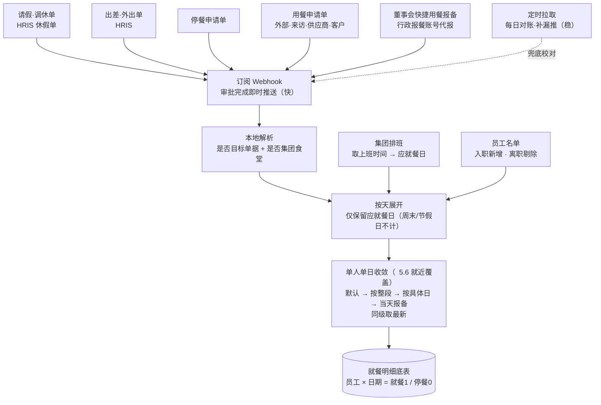
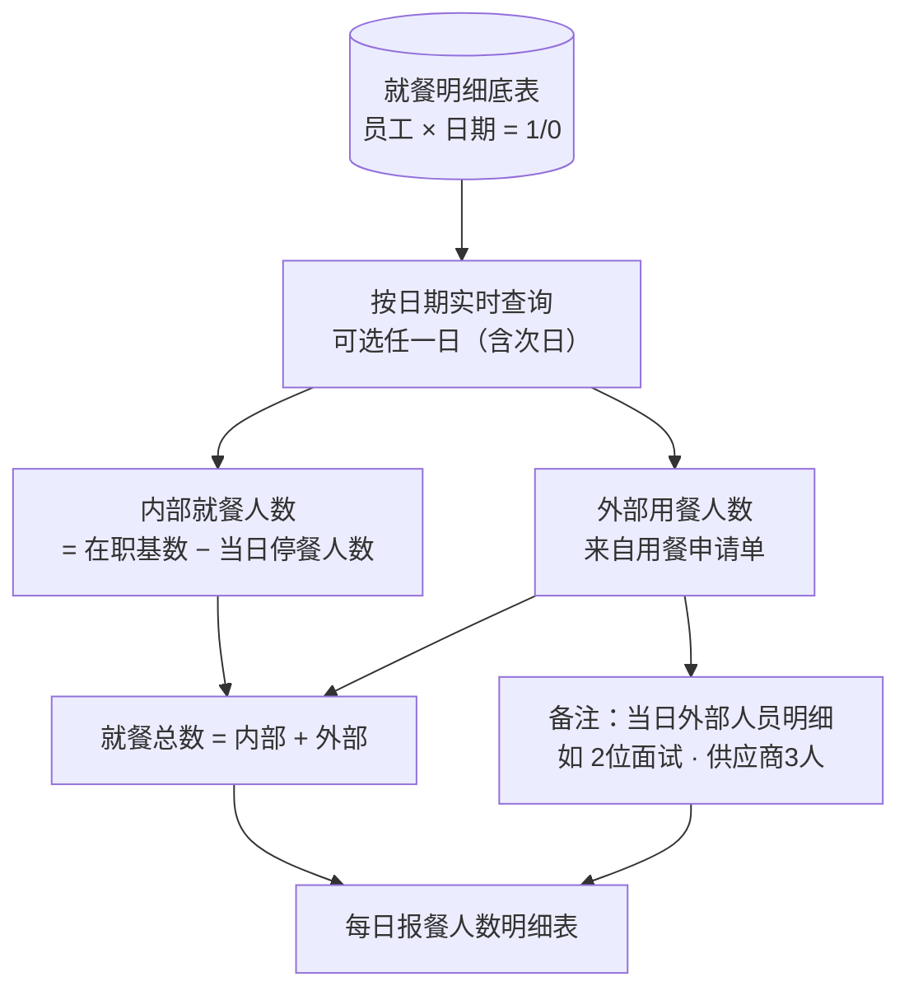
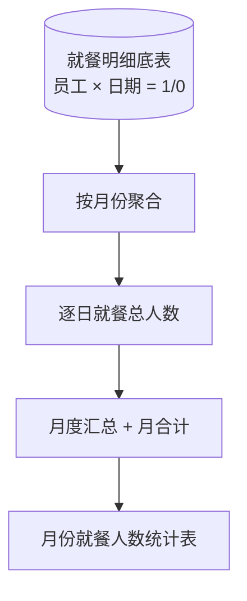
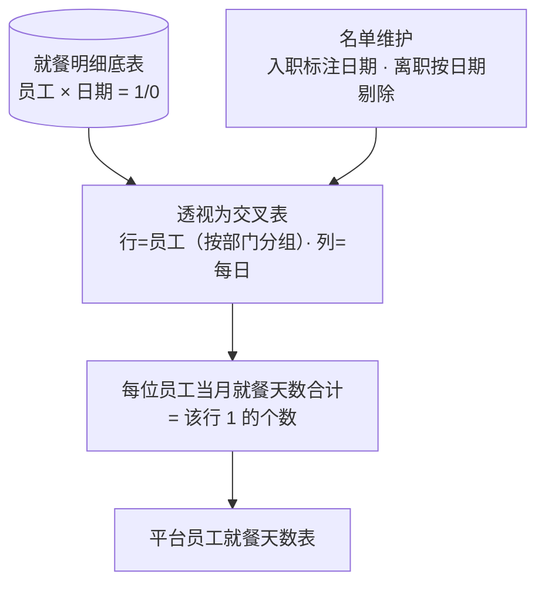

# 就餐项目 · 需求分析与业务拆解

> 本文档为业务需求分析与拆解，**不涉及任何编码**。目的是把行政的手工统计诉求、就餐/停餐的业务规则、数据来源与报表口径梳理清楚，形成可评审、可落地的需求基线。
>
> 范围现阶段**只针对"集团食堂"就餐业务**，但所有规则、字段、取数逻辑均需为**日后其他外地公司/外地食堂**预留扩展位置。

------

## 一、项目概述

### 1.1 背景与痛点

目前行政（行政服务部）每天/每月手工统计集团用餐人数，主要靠导出 HRIS 单据后人工筛选汇总，存在以下问题：

1. **停餐渠道多、数据杂**：停餐来源共 4 个渠道（请假/调休、出差、停餐申请、日程订餐），导出后类目繁杂，人工筛选效率低，导致餐厅报表出具滞后。
2. **每日两次报备耗时**：每天 10:00、18:00 需向厨房报备最新用餐人数；但 HRIS 的请假、出差列表页**不展示"是否停餐"列**，需逐条点进详情查看，重复且耗时。
3. **名单需人工维护**：每月依据花名册手工新增入职、剔除离职，并同步日期。
4. **偏差与浪费**：员工未及时提交请假/出差/停餐，会导致停餐抄送滞后、每日统计偏差、食材浪费。

### 1.2 目标

1. 系统**自动汇总**集团用餐/停餐数据；
2. **减少人工手动汇算**，提升每日/每月统计的效率与准确性；
3. **规范用餐/停餐申请行为**，降低漏报、重复报。

### 1.3 目标人群（业务范围）

| 类别 | 人群                                           | 说明                     |
| ---- | ---------------------------------------------- | ------------------------ |
| 内部 | 集团在职人员                                   | 默认就餐主体             |
| 内部 | 集团离职人员                                   | 名单需按离职日期剔除     |
| 外部 | 工厂人员、面试者、客人、供应商、求职者、客户等 | 通过"用餐申请单"纳入统计 |

### 1.4 涉及系统与数据源（信息说明，非技术方案）

- **数据源**：钉钉 API、HRIS API（IHR 开放平台）。
- **报表呈现**：管理后台系统。
- **说明**：开发环境（jdk1.8 / vue2 / oracle / Element UI）仅作背景记录，本文档不展开技术实现。

------

## 二、核心业务口径（最重要，先统一认知）

以下四条是全项目的"公理"，所有报表取数、规则判断都以此为准：

1. **默认用餐**：集团人员默认每天都在集团食堂就餐（值记为 1）。只有命中"停餐规则"时，当天才记为停餐（值记为 0）。
2. **按天计，不按时分计**：所有用餐/停餐一律以"整天"为最小单位。出差单里"共计(小时):137"这类时长仅用于换算覆盖了哪些自然日，不做按小时的精确扣减。
3. **只统计集团食堂**：出差/外出等单据中"外地公司就餐"字段等于"集团食堂 Group Canteen"时才纳入统计；其他外地食堂现阶段不处理，但留位置。
4. **应就餐日 = 上班日**：周末/节假日不就餐（Excel 样例中周末为空/0）。因此需要同步集团排班，取得每个人的"上班时间/工作日历"，据此确定当天是否为应就餐日。

------

## 三、数据来源梳理（数据口）

需求把数据口分为"停餐数据"和"用餐数据"两大类：

### 3.1 停餐数据（判定"当天不就餐"的来源）

| 序号 | 渠道            | 来源系统       | 处理方式           | 备注     |
| ---- | --------------- | -------------- | ------------------ | -------- |
| 1    | 请假 / 调休申请 | HRIS           | 按请假停餐规则判定 | 见   5.4 |
| 2    | 出差 / 外出申请 | HRIS           | 按出差停餐规则判定 | 见   5.3 |
| 3    | 停餐申请单      | 钉钉/HRIS 表单 | 直接按停餐时段标记 | 见   5.2 |

> **停餐渠道收敛为 3 个**：原"日程订餐"不再作为独立停餐渠道，其使用场景统一由「用餐申请单」承载（见   3.2、Q1 已确认）。

### 3.2 用餐数据（判定"当天就餐"，主要用于外部/特殊人群）

| 序号 | 渠道                                         | 来源系统       | 处理方式                                                     | 备注     |
| ---- | -------------------------------------------- | -------------- | ------------------------------------------------------------ | -------- |
| 1    | 出差 / 外出申请（含"外地公司就餐=集团食堂"） | HRIS           | 按出差就餐规则计入                                           | 见   5.3 |
| 2    | 用餐申请单                                   | 钉钉/HRIS 表单 | 外部人员用餐登记；**统一承载来访/供应商/客户/日程订餐等场景**（Q1、Q2 已确认，保留不取消，计入用餐数据） | 见   5.1 |

> **去重原则**：同一员工同一天可能命中多张单据。需先按"应就餐日"逐日展开，再对同一人同一天做合并去重，避免重复计数。行为规范上也要求：已提交"出差/外出"或"请假"申请的，不再重复提交停餐申请。

------

## 四、四张单据的表单调整需求

> 原则：**小范围修改即可**，不做大改。调整后的表单示意图由需求方/设计侧另行处理。

### 4.1 用餐申请单（面向外部人群）

现有字段：就餐公司、开始时间、结束时间、实际用餐（天）、用餐人数、用餐原因说明、附件、图片。

调整点：

1. **新增"角色"下拉筛选框（必选）**：因为用餐申请单适用于外部人群（供应商、求职者、客户等），需要用角色区分来访人员类型。
2. **明确两个易混字段的口径**：同一张单据上的"用餐人数"与"实际用餐（天）"是两个不同维度——人数是当次有多少人，天数是覆盖多少天，统计时不可混用。
3. **董事会人员例外规则待制定**：针对董事会人员的"默认用餐/默认停餐"规则需专门制定（见   7）。

### 4.2 停餐申请单（集团内部使用）

用途：非出差/外出/请假原因、但不在集团/基地/工厂就餐的人员，需**提前**做停餐申请。

现有字段：停餐说明、停餐公司、停餐时间（停餐开始时间、停餐结束时间、时长(天)）、事件描述。

规则要点：

- 默认集团都是用餐的，本单**按天算不按时分算**。
- 已做"出差/外出"或"请假"申请的，**不需重复**提交停餐申请（避免重复扣减）。

### 4.3 出差 & 外出申请单

获取 HRIS 数据时要做筛选计算（按天算不按时分算），并为外地公司预留兼容位置。表单内"是否需要停餐 / 外地公司就餐"字段决定统计口径，三种停餐计算方式见   5.3。

### 4.4 请假申请单

获取 HRIS 休假单数据时同样按天筛选计算。**只取休假时间区间与"是否停餐/用餐"，不区分假期类型**。表单内"是否停餐"字段决定统计口径，三种停餐计算方式见   5.4。

------

## 五、停餐/用餐判定规则拆解（业务逻辑核心）

### 5.1 用餐申请单 → 计入"用餐"

- 适用外部人群；按单据的"实际用餐（天）× 用餐人数"计入对应日期的外部用餐数。
- 需按新增的"角色"区分来访类型，供报表备注展示（如：面试、客人、供应商）。

### 5.2 停餐申请单 → 计入"停餐"

- 直接按"停餐开始时间 ~ 停餐结束时间"覆盖的每个应就餐日标记停餐。

### 5.3 出差/外出申请单 → 三种停餐计算方式

前置筛选：**"外地公司就餐"= 集团食堂 Group Canteen** 才纳入记录（否则视为不在集团食堂就餐，不计集团食堂停餐）。

| 方式   | 触发条件                               | 停餐日期取值                                        |
| ------ | -------------------------------------- | --------------------------------------------------- |
| 方式一 | "是否需要停餐"= 按出差/外出时间停餐    | 以**出差开始~结束时间**覆盖的应就餐日全部停餐       |
| 方式二 | "是否需要停餐"= 按填写具体停餐时间停餐 | 以员工填写的**具体停餐开始/结束日期（时长天）**为准 |
| 方式三 | "是否需要停餐"= 不停餐                 | 当期不停餐（照常就餐）                              |

### 5.4 请假/调休申请单 → 三种停餐计算方式

**不需要区分假期类型**（事假/年假/病假等枚举与就餐统计无关）。只需从休假单中取出：**休假时间区间** + **是否停餐/用餐**，据此判定停餐日期。

| 方式   | 触发条件                           | 停餐日期取值                                  |
| ------ | ---------------------------------- | --------------------------------------------- |
| 方式一 | "是否停餐"= 按请假时间停餐         | 以**请假开始~结束时间**覆盖的应就餐日全部停餐 |
| 方式二 | "是否停餐"= 按填写具体停餐日期停餐 | 以员工填写的**具体停餐日期段**为准            |
| 方式三 | "是否停餐"= 不停餐                 | 当期不停餐（照常就餐）                        |

### 5.5 ※董事会人员默认规则（方案已拟定，待业务方确认）

董事会人员（如"龙派董事会"）的用餐特征与普通员工**相反**：大部分时间在外，默认不就餐，偶尔回来就餐。因此采用"**翻转默认 + 轻量用餐报备 + 允许代报**"：

1. **翻转默认（按人设置）**：在后台"停餐/用餐固定人设置"中，将每位董事会成员单独设为**默认停餐**（个别常在者也可设为默认用餐）。系统每天自动记为停餐（0），平时**零操作**。
2. **例外用餐走快捷报备**：偶尔回来就餐时，只需极简动作（选"当天用餐"或勾选用餐日期段）即可，无需填人数、原因等完整字段。命中报备的当天，将默认的 0 覆盖为就餐（1）。
3. **允许行政代报（已确认）**：由**行政报餐人员账号**统一代董事会成员发起用餐报备；建议提供成员面板，勾选"今日回来就餐"的人一次提交，落实需求中"行政代发起用餐申请"。
4. **支持日期段**：可一次性报连续多日用餐（如 8/12–8/16），不必每日操作。
5. **报备口径（已确认）**：采用**按天报备**，与全项目"按天算"口径一致；董事会成员/行政可**随时**报备或修改，系统实时反映到汇总，**不设系统截止时间**（行政导数给食堂的 10:00 / 18:00 只是其操作节奏，属下游使用，非系统统计节点，见   6.1）。

> 状态：代报账号（行政报餐人员账号）**已确认**；系统只提供实时查询/汇总、不设报备截止（见   6.1）。**默认停餐名单**暂未提供，待需求方与相关人员确认后补入（见 Q3）。

### 5.6 ※单人单日合并逻辑（汇总口径 · 就近覆盖原则）

**目标**：某员工、某个应就餐日，最终只收敛出**一个状态——就餐(1) 或 停餐(0)**，用于报备备餐。由于全项目**按天算**，一天不拆分时段，故同一人同一天存在多个来源信号时，按以下"**就近覆盖**"原则收敛——不比较来源是出差还是请假，而比较声明**对当天的针对性**与**提交时间**。

**优先级（高 → 低，高层级覆盖低层级）：**

| 级别       | 信号类型                                 | 说明                                                         |
| ---------- | ---------------------------------------- | ------------------------------------------------------------ |
| L1（最高） | 专门针对当天的单独报备                   | 停餐申请单、个人/董事会当天用餐报备——员工专为这天提交，最可信 |
| L2         | 单据"按具体停餐日期"指定的日期（方式二） | 出差/请假单里明确点到的停餐日                                |
| L3         | 单据"按整段时间"推导的停餐（方式一）     | 出差/请假整段覆盖的应就餐日                                  |
| L4（最低） | 系统默认                                 | 普通人=就餐(1)；董事会=停餐(0)                               |

**收敛步骤（每人每应就餐日）：**

1. 起点取 L4 默认值（普通人 1 / 董事会 0）。
2. 逐级向上，用更高级别信号覆盖当天状态（L1 覆盖 L2、L2 覆盖 L3…）。
3. **同一级别内出现相互矛盾**（如两张都针对当天的报备一停一吃）→ **以最后提交的那张单为准**（尊重员工最新意思表示）。
4. 外部人员另按用餐申请单单独计入外部用餐数，不与内部默认逻辑混算。

> 该原则对"改成吃"和"改成停"同样适用，无需为出差、请假分别写规则。示例：出差整段停餐但周三交了当天用餐报备 → 周三就餐、其余停餐；请假选"不停餐"后又交停餐申请单停周四 → 周四停餐。

------

## 六、报表设计（三张目标报表）

### 6.1 每日报餐人数明细表（实时查询 / 汇总）

**系统职责**：提供某一天的就餐人数**实时汇总**，行政可**随时按日期查询**（含**次日**——因停餐/用餐单据多为提前提交，次日人数当下即可算出），并按需导出。

> 口径澄清：行政每天 **10:00 / 18:00** 导出数据报给食堂，是她**给厨房提前报下一天就餐人数的操作节奏**，属**下游使用**；**不是本系统的统计截止或口径节点**。系统不设任何"报备截止"逻辑，只保证她查询/导出的那一刻数据是最新的。

参考 Excel 样例字段：

| 字段                     | 说明                                                         |
| ------------------------ | ------------------------------------------------------------ |
| 序号 / 日期              | 应就餐日；周末/节假日不产生数据；支持选择任一日期（含次日）  |
| 内部就餐人数             | 集团在职基数 − 当日停餐人数                                  |
| 外部用餐人数             | 来自用餐申请单/来访                                          |
| 就餐人员总数             | 内部 + 外部                                                  |
| 备注（每天外部用餐人员） | 外部人员明细，如"2 位面试""总经办 1 客人""供应商 3 人"       |
| 食材金额 / 人均费用      | **不计入系统自动统计（Q4 已确认）**；如需保留由餐厅侧线下人工填报，不属本系统职责 |

> 该表**必须能不进详情就看到指定日期的用餐/停餐总数**，供行政一眼查看、随时导出。

### 6.2 月份就餐人数统计表（每月）

- 按月汇总每日就餐人数，形成月度趋势/合计。
- 数据来源与每日表一致，按天累加。

### 6.3 平台员工就餐天数表（每月）

- **交叉表结构**：行=员工（按部门分组，如龙派董事会/总经办/见龙工作室/交付（业务）中心/美国销售部/船务部/订单服务部/美国大客户业务部等），列=当月每一天，单元格=0/1（就餐/停餐），行末=该员工当月**就餐天数合计**。
- 名单需支持入职（新增列/行并标注入职日期，如"20260106 入职"）、离职（按日期剔除）自动维护。

------

## 七、※问题确认清单

### 7.1 已确认结论

| 编号 | 问题                                  | 结论                                                         |
| ---- | ------------------------------------- | ------------------------------------------------------------ |
| Q1   | 日程订餐是否取消                      | **不取消**；日程订餐场景统一由「用餐申请单」承载，不再作为独立停餐渠道，停餐渠道收敛为 3 个 |
| Q2   | 客户/供应商来访申请单是否纳入用餐数据 | **纳入**；来访/供应商/客户统一通过「用餐申请单」登记，计入用餐数据 |
| Q4   | 食材金额/人均费用是否由系统统计       | **不计入**系统自动统计；如需保留由餐厅侧线下人工填报         |
| Q6   | 单据获取用订阅还是拉取                | **订阅为主 + 定时拉取兜底对账**（详见   8）——满足"响应快"，同时靠拉取兜底保证"稳、不漏" |
| Q5   | 多单/多方式冲突时的停餐优先级         | **就近覆盖 + 同级取最新**（详见   5.6）——按对当天的针对性分级覆盖，同级矛盾以最后提交的单为准 |

### 7.2 尚待需求方拍板

| 编号 | 待确认问题                                                   | 影响       |
| ---- | ------------------------------------------------------------ | ---------- |
| Q3   | **董事会默认停餐名单**：方案已定（翻转默认停餐 + 快捷用餐报备 + 行政报餐账号代报 + 按天报备、系统实时查询不设截止，见   5.5）；**仅默认停餐名单**暂未提供，待需求方与相关人员确认后提供 | 5.5、  4.1 |

------

## 八、数据采集方式（已确认：订阅为主 + 拉取兜底）

### 8.1 结论

采用**订阅（即时触发）为主 + 定时拉取兜底对账**。理由：本项目数据量不大，但行政需**随时实时查询汇总**、要求"响应快且稳定"；订阅满足"快"，拉取兜底以极低成本补齐"稳、不漏"。

### 8.2 两种方式难度与稳定性对比

| 维度     | 订阅（Webhook 推送）                                 | 定时拉取（轮询）                           |
| -------- | ---------------------------------------------------- | ------------------------------------------ |
| 响应速度 | **快**，单据审批完成即时推送                         | 慢，取决于轮询频率（分钟级时延）           |
| 实现难度 | 中：需对外暴露回调地址、验签鉴权、幂等去重、漏推补偿 | 低：定时调接口、翻页、按单据唯一ID去重     |
| 稳定性   | 依赖回调服务在线；对方不重试时宕机期会**漏推**       | 好：本次失败下次轮询自动补，可重跑、可对账 |
| 安全面   | 需开放外网入口，攻击面更大                           | 无需对外暴露端点，面更小                   |
| 依赖     | 需 HRIS 在流程高级设置里配好"数据同步接口地址"       | 只依赖"查询已完成单据"接口                 |

> 实现复杂度排序：纯拉取 < 订阅 < 订阅+兜底。组合方案虽最复杂，但换来"快且稳"，最匹配本项目诉求。

### 8.3 组合方案职责划分

- **订阅**：负责即时刷新——单据审批完成后立即推送、本地解析是否为目标（停餐/用餐相关）并入库，保证行政**随时查询/导出时数据即为最新**。需保证：验签、按单据唯一ID幂等、失败重试。
- **定时拉取**：负责兜底对账——每日按参数拉取"已完成单据"，与订阅已入库数据比对，补齐订阅偶发漏推、修正状态变更。数据量小，成本可忽略。

------

## 九、工作清单与责任拆解（方案工作清单）

| 序号 | 环节         | 工作项              | 涉及范围                                                     |
| ---- | ------------ | ------------------- | ------------------------------------------------------------ |
| 1    | 数据规范     | 表单调整            | 用餐申请表单（新增角色下拉等，  4.1）                        |
| 2    | 数据规范     | 用户行为规范        | 停餐/用餐申请（避免漏报、重复报，  4.2）                     |
| 3    | 数据采集     | 停餐/用餐申请同步   | 停餐数据（请假/调休、出差申请单、停餐申请单）+ 用餐数据（出差申请单、用餐申请单） |
| 4    | 数据采集     | 集团排班同步        | 获取上班时间（确定应就餐日，  二·4）                         |
| 5    | 后台管理功能 | 数据报表            | 每日报餐人数明细表（  6.1）                                  |
| 6    | 后台管理功能 | 数据报表            | 月份就餐人数统计表（  6.2）                                  |
| 7    | 后台管理功能 | 数据报表            | 平台员工就餐天数表（  6.3）                                  |
| 8    | 后台管理功能 | 停餐/用餐固定人设置 | 董事会翻转默认停餐 + 快捷用餐报备 + 行政代报（  5.5，方案已拟定待 Q3 确认） |
| 9    | 后台管理功能 | 用餐汇算            | 后台定时任务，按天汇算就餐/停餐（  5.6）                     |

------

## 十、行政优化需求 → 本方案映射

| 行政优化诉求                                            | 本方案对应                                                   |
| ------------------------------------------------------- | ------------------------------------------------------------ |
| ① 精简导出内容，剔除无关字段                            | 四 表单调整 +   六 报表只保留报备所需字段                    |
| ② 若日程订餐无法系统统计则取消                          | 已确认（Q1）：日程订餐并入用餐申请单、不取消其场景；停餐渠道收敛为请假/调休、出差、停餐申请 3 个 |
| ③ 请假/出差列表页直接新增"停餐展示列"，不进详情即可查看 | 6.1 报表 +   5 判定规则落到列表列，解决"逐条点详情"的痛点    |

> HRIS 现状（附图 1–4）：出差/请假流程台账和出勤记录里，开始/结束时间部分可见，但**"是否停餐"均无法在列表直接看到**，需进详情——这正是本项目要通过自建报表/列消除的重复操作。

------

## 十一、业务流程图

> 说明：先是一条**公共主链路**（从单据到"就餐明细底表"），三张报表都基于同一张底表，但各自的取数与呈现不同，故**拆成三张分图**，便于分别理解与评审。图中文字即注释。

### 11.1 主链路：数据采集 → 判定 → 就餐明细底表

注释：默认用餐、按天算、只统计集团食堂；休假单只取时间区间与是否停餐、不看假期类型；董事会默认停餐（名单待定）。此"底表"是三张报表的唯一数据源。

### 11.2 报表① 每日报餐人数明细表（实时查询 / 汇总）

注释：系统只需**实时汇总**、供行政随时按日期查询与导出（含次日）；**10:00 / 18:00 是行政导数报给食堂的操作时间，非系统统计节点**，不设报备截止。食材金额 / 人均费用**不由系统统计**（Q4），如需保留由餐厅侧线下填报。

### 11.3 报表② 月份就餐人数统计表

注释：口径与每日表一致，按天累加；用于观察当月趋势与总量。

### 11.4 报表③ 平台员工就餐天数表

注释：部门分组示例——龙派董事会 / 总经办 / 见龙工作室 / 交付（业务）中心 / 美国销售部 / 船务部 / 订单服务部 / 美国大客户业务部等；单元格 0/1 与行末合计天数直接来自底表。

------

## 附录 A · 休假单取数说明

就餐统计**不区分假期类型**（事假/年假/病假等枚举与是否就餐无关）。从休假单只取两项：

- **休假时间区间**（开始~结束，按天展开覆盖的应就餐日）；
- **是否停餐/用餐**及（如有）具体停餐日期段。

据此按   5.4 判定每个应就餐日是停餐还是就餐即可。

## 附录 B · 涉及的 HRIS 开放平台接口（信息记录）

| 用途                                        | 接口地址                                     | 方式 |
| ------------------------------------------- | -------------------------------------------- | ---- |
| 获取出差单                                  | `.../api/tm/v1/businesstravel/orders/search` | POST |
| 获取外出单                                  | `.../api/tm/v1/fieldwork/orders/search`      | POST |
| 获取休假单                                  | `.../api/tm/v1/vacations/orders/search`      | POST |
| 按参数查询已完成审批单据（拉取方式）        | `.../api/workflow/v1/process/finish/page`    | POST |
| 发起/审批单据后同步数据（订阅方式 webhook） | `{baseUrl}/v1/workflow/webhook/submit`       | POST |

> 接口仅作背景记录，具体调用与字段映射属实现范畴，不在本需求文档展开。

## 附录 C · 兼容性与扩展预留

- 所有停餐/用餐判定、报表取数、"外地公司就餐"筛选，现阶段只落地"集团食堂"，但字段与规则需按"公司/食堂"维度设计，便于日后接入其他外地公司与食堂。

## 补充：

测试数据库连接：

> 连接名称：DINING_PROGRAM
>
> 
>
> ip:192.168.1.241
> 端口：1521
> 服务名称:ORCL
> 用户名:LPDCM
> 密码:LPDCM

数据源理解：

假设请假申请单链路流程：

IHRS系统：用户在这里提交请假单据、有对应审批人：一级审批人、二级审批人、三级审批人

LPDCM.HRIS_INS_DATA表：承接该单据的所有数据信息，包括审批也是存一行

此时[发起和审批单据后同步数据](https://open.ihr360.com/#/企业应用API/审批相关/OA回调接口规范/发起和审批单据后同步数据)：事件订阅{baseUrl}/v1/workflow/webhook/submit

- **订阅**：负责即时刷新——单据审批完成后立即推送、本地解析是否为目标（总部请假单、停餐、用餐申请、出差、外出、）并入库，保证行政**随时查询/导出时数据即为最新**。需保证：验签、按单据唯一ID幂等、失败重试。
- **定时拉取**：负责兜底对账——每日按参数拉取"已完成单据"，与订阅已入库数据比对，补齐订阅偶发漏推、修正状态变更。数据量小，成本可忽略。

假设新表：LPDCM.OA_DINING_RECEIPTS表：收集处于审批中、审批通过、审批失败的数据

因为新表的数据就是我所有目标报表的数据源，所以这里就是要特别注意

提交单据：

> https://v5.ihr360.com/gateway/workflow/aggregate/staff/createProcess?r_id=b79fxaz3gd536qfb&u_id=1139009834949804032

## 外射端口

> 120.236.114.219:9989

